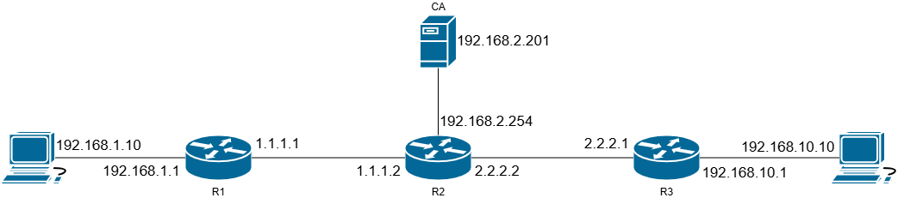

# site-to-site ipsec vpn

## initialisation

### topologie



### configuration

On fait le routage via OSPF sur les 3 routeurs pour toutes les interfaces.

## psk (pre-shared key)


R1 :

```cios
enable
conf t
crypto isakmp policy 1
authentication pre-share
encryption aes 256
group 5 
hash sha
exit

crypto isakmp key SECRETKEY address 2.2.2.1

crypto ipsec transform-set MYTRANSFORMSET ah-sha-hmac esp-aes 256

crypto map MYMAP 1 ipsec-isakmp
match address 100
set peer 2.2.2.1
set transform-set MYTRANSFORMSET

exit
interface Fa 0
crypto map MYMAP
exit

access-list 100 permit icmp host 192.168.1.10 host 192.168.10.10
```


R3 :

```cios
enable
conf t
crypto isakmp policy 1
authentication pre-share
encryption aes 256
group 5 
hash sha
exit

crypto isakmp key SECRETKEY address 1.1.1.1

crypto ipsec transform-set MYTRANSFORMSET ah-sha-hmac esp-aes 256

crypto map MYMAP 1 ipsec-isakmp
match address 100
set peer 1.1.1.1
set transform-set MYTRANSFORMSET

exit
interface Fa 0
crypto map MYMAP
exit
 
access-list 100 permit icmp host 192.168.10.10 host 192.168.1.10
```

## digital cert

Préparation des routeurs, on a besoin d'un domaine pour signer le CA.
On génère la paire de clef.

1) `show clock`, pour changer l'horloge : `clock set ...` 
2) faire un domaine `ip domain-name XXXX`
3) Génération key pair : `crypto key generate rsa modulus 2048`

### config du serveur

dans le server manager du windows server, aller dans :
Manage > add roles and features : une fenêtre s'ouvre

aller dans :
server roles > cocher : active directory cert services
roles services >  cocher : certification authority, certification authority web enrollment, network device enrollment service

une fois que le rôle est ajouté, aller dans "computer management" (cmpmgmt.msc)
1) ajouter Administrator dans le groupe `IIS_IUSRS` 
2) il y a un popup qui apparaît dans internet explorer, il faut cliquer sur l'action qu'il propose
3) ouvrir dans le navigateur `127.0.0.1/certsrv/mscep_admin`, la clef apparaît, on voit le fingerprint du CA. Le enrollment challenge est valable que pour un appareil, il change à chaque fois que la page est rechargée

### configuration des routeurs

1) création d'une entrée dns statique sur les routeurs 

```
! ip du CA
ip host server.hepl.local 192.168.2.201 

! chercher le certificat
crypto pki trustpoint MYCA
enrollment url http://server.hepl.local/certsrv/mscep.dll
enrollment mode ra

```

si la config fonctionne bien quand on fait `crypto pki authenticate MYCA`, il y a un prompt qui apparaît avec le fingerprint du CA, il faut écrire `yes`.

```
crypto pki enroll MYCA
```

un mdp va être demandé, c'est le mdp du challenge de la page web

une fois que le mdp est entré, répondre aux différentes question par `yes` quand c'est possible.

dans sur le serveur windows, il faut aller dans `certsrv.msc` ouvrir le menu déroulant de gauche et aller dans pending requests. sélectionner le certificat, clic droit all tasks, issue

retirer la config avec pre-shared key pour être sûr qu'on utilise pas l'ancienne config pour le vpn

```cios
no authentication pre-share
authentication rsa-sig
no crypto isakmp key
```

## filtrage
