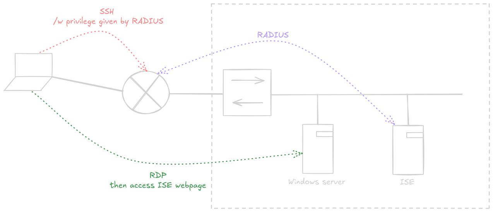

# Labo 1 - SSH

## Topologie



---

## Configuration de l'ISE

- *Administration > Identity Management*: Créer deux utilisateurs et deux groupes
- *Administration > Network Devices*: Ajouter le routeur avec une PSK
- *Policy > Policy Sets*: Ajouter une nouvelle policy set
- Condition pour le policy set: `Radius NAS-Port-Type Equals Virtual`
- Allowed protocols: Default network access (Doit contenir PAP/ASCII)
- Naviguer sur le menu *View* (flèche)
- Ajouter une *Authentication policy*:
	- Condition: `Radius NAS-Port-Type Equals Virtual` 
	- Use: Internal Users
- Ajouter une *Authorization policy* pour l'admin junior:
	- Condition: `Radius NAS-Port-Type Equals Virtual` AND `IdentityGroup-Name Equals User Identity Groups:Groupe1`
	- Authorization Profile: `cisco-av-pair = shell:priv-lvl=7`
- Ajouter une *Authorization policy* pour l'admin junior:
	- Condition: Idem que précdent mais autre Groupe2
	- Authorization Profile: `cisco-av-pair = shell:priv-lvl=15`

## Configuration du routeur

### SSH

```
ena
! Enable AAA
aaa new-model

! Create a method list that allows console access with no authentication
aaa authentication login CONSOLENOPROTECTION none
aaa authorization exec CONSOLENOPROTECTION none

! Apply method list to console line
line console 0
 login authentication CONSOLENOPROTECTION

! (Optional) Create a local user for fallback or other logins
username admin privilege 15 secret yourStrongPassword

! Define RADIUS-based login method for VTY lines
aaa authentication login loginWithRadius group radius
aaa authorization exec default group radius

! Set enable secret
enable secret cisco

! Set domain name (required for SSH key generation)
ip domain name labo.local

! Generate RSA keys for SSH
crypto key generate rsa general-keys modulus 2048

! Configure SSH-only access on VTY lines
line vty 0 15
 transport input ssh
 login authentication loginWithRadius
```

### Radius

```
radius-server host 192.168.2.200 key antaxefre
```

### Privilege levels

```
! Define Priviledges
privilege exec level 7 configure terminal
privilege exec level 7 interface
...
```

## Connect!

No rest for the wicked Linux users:

```
ssh -o KexAlgorithms=diffie-hellman-group14-sha1 -o HostKeyAlgorithms=ssh-rsa -o Ciphers=aes256-cbc User1@192.168.2.254
```

Windows: just use putty.