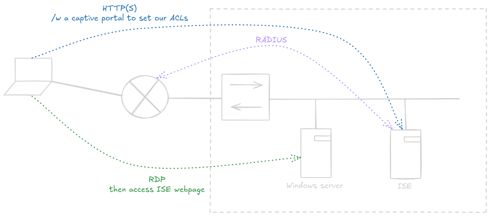

# Labo 2 - Captive Portal

## Topologie



---

## Configuration de l'ISE

- *Administration > Identity Management*: Créer un utilisateur et un groupe
- *Administration > Network Devices*: Ajouter le routeur avec une PSK
- *Policy > Policy Sets*: Ajouter une nouvelle policy set
- Condition pour le policy set: `Radius NAS-Port-Type Equals Virtual`
- Allowed protocols: Default network access (Contenir PAP/ASCII)
- Naviguer sur le menu *View* (flèche)
- Ajouter une *Authentication policy*:
	- Condition: `Radius NAS-Port-Type Equals Virtual` 
	- Use: Internal Users
- Ajouter une *Authorization policy*:
	- Condition:   
	`Radius NAS-Port-Type Equals Virtual`  
	 AND   
	 `IdentityGroup-Name Equals User Identity Groups:Groupe1`
	- Authorization Profile:  
	`cisco-av-pair = auth-proxy:priv-lvl=15`   
	`cisco-av-pair = auth-proxy:proxyacl#1=permit icmp any any`  
	`cisco-av-pair = auth-proxy:proxyacl#2=permit tcp any any`  
	`cisco-av-pair = auth-proxy:proxyacl#3=permit udp any any` 

## Configuration du routeur

### Base config

```
hostname ROUTER1

! RDP Interface
interface FastEthernet1
 ip address 192.168.1.254 255.255.255.0
 duplex auto
 speed auto

! ISE Interface
interface fastEthernet0
 ip address 192.168.2.254 255.255.255.0
 duplex auto
 speed auto

! User Login Interface
interface Vlan1
 ip address 192.168.3.254 255.255.255.0
 ip access-group 100 in
 duplex auto
 speed auto
 ip auth-proxy MY_AUTH_PROXY

exit
access-list 100 permit tcp any host 192.168.3.254 eq www

! Join the ISE
radius-server host 192.168.2.200 key antaxefre
```

### AAA  

```
aaa new-model

! Default login via RADIUS
aaa authentication login default group radius

! Console-specific local login
aaa authentication login CONSOLE_PROTECTION local
aaa authorization exec CONSOLE_AUTHORIZATION local
aaa authorization console

! Auth-proxy uses RADIUS for authorization
aaa authorization auth-proxy default group radius

aaa session-id common

! Local user for fallback or testing
username cisco privilege 15 secret cisco
```

### HTTP(S)

```
ip http server
no ip http secure-server
ip http authentication aaa

! Auth-proxy configuration
ip auth-proxy name MY_AUTH_PROXY http
```

### Misc

```
line con 0
 login authentication CONSOLE_PROTECTION
 authorization exec CONSOLE_AUTHORIZATION

line aux 0

line vty 0 4
 transport input all
```

## Tester le captive portal

Surfer sur la page de l'ISE; un captive portal devrait apparaître.