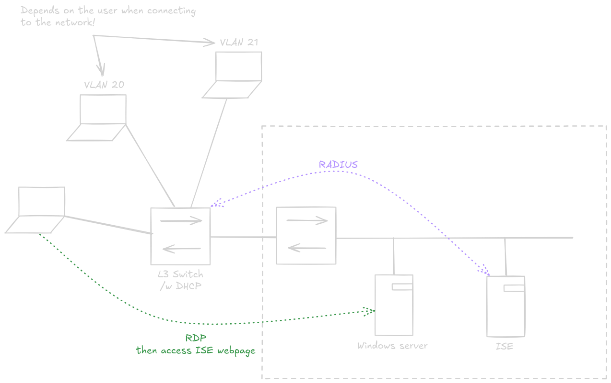

# Labo 4 - 802.1X Wired

## Topologie



---

## Configuration de l'ISE

### Sans certificat

- *Administration > Identity Management*: Créer deux utilisateurs et deux groupes (un pour chaque vlan)
- *Administration > Network Devices*: Ajouter le switch avec une PSK
- *Policy > Policy Sets*: Ajouter une nouvelle policy set
- Condition pour le policy set: `Radius NAS-Port-Type Equals Ethernet`
- Allowed protocols: PEAP-MSCHAPv2
- Naviguer sur le menu *View* (flèche)
- Ajouter une *Authentication policy*:
	- Condition: `Radius NAS-Port-Type Equals Ethernet` 
	- Use: Internal Users
- Ajouter une *Authorization policy*:
	- Condition: `Radius NAS-Port-Type Equals Ethernet` AND `IdentityGroup-Name Equals User Identity Groups:Groupe1`
	- Authorization Profile: *Common Tasks > VLAN*: Spécifier un vlan ID
- Refaire une *Authorization policy* pour l'autre groupe

## Configuration du switch L3

### Basic

```
hostname SWITCH1
ip routing

! ISE Network
interface FastEthernet1/0/1
 description Link to ISE
no switchport
ip address 192.168.2.254 255.255.255.
no shutdown

! RDP User
interface FastEthernet1/0/3
 description Admin - RDP
 switchport mode access
 switchport access vlan 1
 spanning-tree portfast

! User
interface Fa1/0/19
 ! NEED IT TO ALLOW MULTI HOST
 ! DEAD FOR VM THEN
 authentication host-mode multi-auth
 switchport mode access
 dot1x pae authenticator
 dot1x port-control auto

! VLAN 1
interface vlan1
ip address 192.168.1.254 255.255.255.0
no shutdown

! VLAN 20 
interface Vlan20
 ip address 192.168.20.254 255.255.255.0
 no shutdown

! VLAN 21
interface Vlan21
 ip address 192.168.21.254 255.255.255.0
 no shutdown

exit

line con 0
 login

line vty 0 4
 transport input ssh
```

### AAA

```
aaa new-model
aaa authentication dot1x default group radius
aaa authorization network default group radius
aaa session-id common

radius-server host 192.168.2.200 key antaxefre
```

### DHCP

```
ip dhcp pool VLAN20
 network 192.168.20.0 255.255.255.0
 default-router 192.168.20.254

ip dhcp pool VLAN21
 network 192.168.21.0 255.255.255.0
 default-router 192.168.21.254
```

## Avec certificat

- Possiblement renouveler le certificat en changeant le renewal period !
- *Administration > Certificate > Certificate Management > System Certificates*: Exporter le certificat used by EAP Authentication
- Installer le certificat  avec une extension .crt sur l'endpoint

## Connection au réseau

### Sans certificat

Attention aux VMs et aux adaptateurs ethernet! => Activer le multihost sur l'interface.

- Activer le service "*Configuration automatique du réseau câblé*"
- *`ncpa.cpl` > Propriétés > IPv4*: Utiliser DHCP
- *`ncpa.cpl` > Propriétés > Authentification*: Activer IEEE 802.1X, PEAP
- *`ncpa.cpl` > Propriétés > Authentification > PEAP Settings*: Désactiver la vérification de certificats et utiliser MSCHAPv2
- *`ncpa.cpl` > Propriétés > Authentification > Paramètres supplémentaires*: Spécifier les credentials

Possiblement désactiver et réactiver l'interface, et vérifier si la bonne adresse a été obtenue

### Avec certificat

Activer la vérification de certificats avec *AAA Certificate Services* situé dans les propriété de l'interface.
