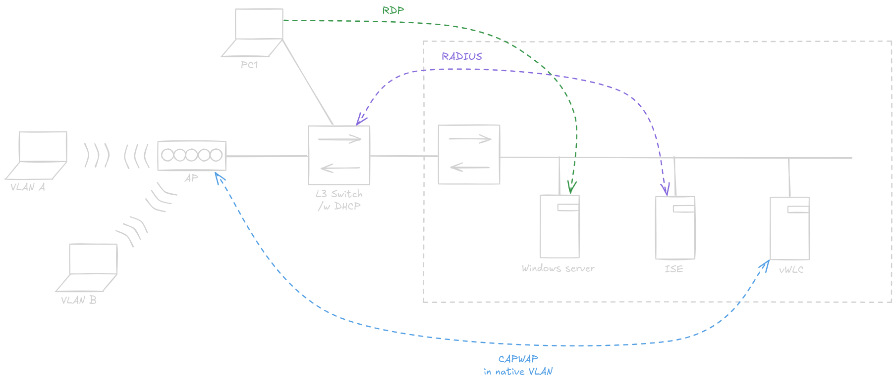
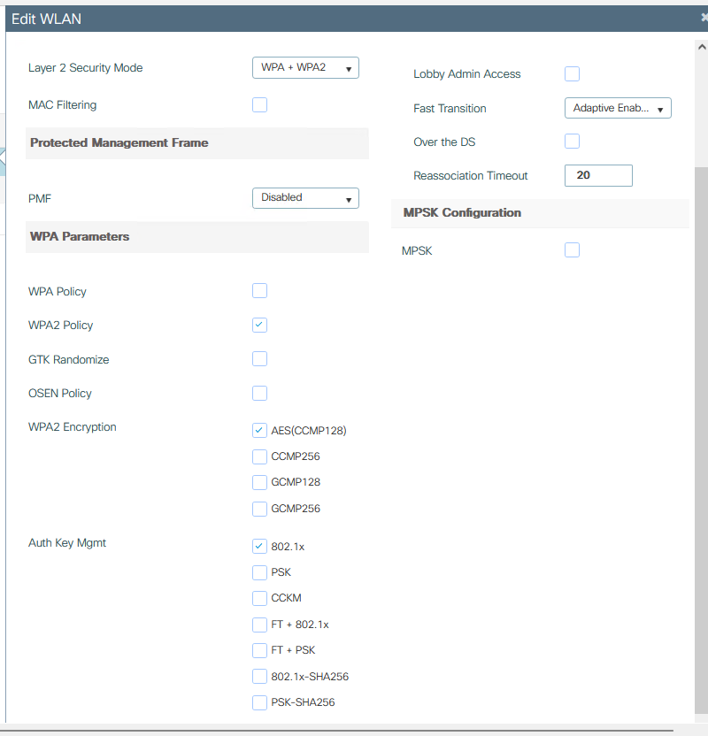

# Labo 4 - 802.1X Wireless

## Topologie

---
## Configuration du switch L3

- Configurer un adresse et un pool DHCP sur le VLAN 1 pour PC1
- Configurer un trunk entre le switch et l'AP avec 3 VLANs:  
	- Un VLAN natif pour la communication CAPWAP entre le vWLC et l'AP
	- Deux autres pour différents groupes de clients
- Configurer des pools DHCP pour ces trois VLANs
	- Le pool DHCP du VLAN natif a besoin d'une option spéciale pour que l'AP puisse contacter son controlleur: `option 43 hex f104c0a802cc`

> [!NOTE]
> les 8 derniers chiffres hexadécimaux correspondent à l'adresse IP du vWLC

## Configuration du vWLC

- *Configuration > Static Routing*: Ajouter un route statique vers le subnet de l'AP, avec l'IP du switch comme next hop.
- *Monitoring > Wireless > AP Statistics*: Vérifier que l'AP est bien en état registered

### Sans AAA

- *Configuration > Tags & Profiles > Tags > Site*: Dans le *default-site-tag*, décocher "Local Site"
- *Configuration > Wireless > Access-pointS*: Vérifier que l'AP est bien en mode "Flex"
- *Configuration > Tags & Profiles > Flex > default-flex-profile*: Spécifier le VLAN natif
- Dans le submenu VLAN: Spécifier les VLANs utilisateurs.

- *Configuration > Wireless Setup > Advanced*: Cliquer sur "Start Now". On configurera les trois premières tuiles (WLAN Profile, Policy Profile, Policy Tag)
- *WLAN Profile*: Spécifier un SSID, passer le statut en "Enabled".
- Dans l'onglet "Security", on le met à None pour le moment.
- *Policy Profile*: Choisir un nom, Status enabled, Central DHCP et Switching disabled.
- Dans l'onglet "Access Policies", spécifier l'ID d'un VLAN utilisateur.

> [!WARNING]
> C'est normal que les VLANs n'apparaissent pas dans le menu déroulant. C'est suffisant de juste écrire l'ID du VLAN dans la zone texte.

- *Policy Tag*: Lier les deux profils précédemment créés dans une nouvelle "WLAN-POLICY Map"
- Apply

- *Monitoring > Wireless > AP Statistics*: Vérifier que tout s'est bien appliqué en cliquant sur le petit icone bleu à côté du nom de l'AP

On peut maintenant se connecter au SSID configuré.
 
### Sécurisation avec AAA

- *Configuration > Security > AAA > Server/Groups*: Ajouter le serveur ISE, et l'ajouter dans un server group
- *Configuration > Security > AAA > AAA Method List*: Dans authentication, ajouter un entrée avec dot1x et sélectionner le groupe créé précedemment
- Dans authorization, ajouter une entrée avec Type = network et notre groupe

- On peut maintenant modifier la sécurité dans Wireless Setup
- *WLAN Profile*: Bien cocher AES & 802.1X:  

- Dans l'onglet AAA, sélectionner la liste d'authentification crée précedemment
- *Policy Profile > Advanced*: Allow AAA Override 

## Configuration de l'ISE

- Ajouter le vWLC dans les network devices
- Idem que pour le labo wired, sauf que `NAS-Port-Type EQUALS Wireless-IEEE802.11`
