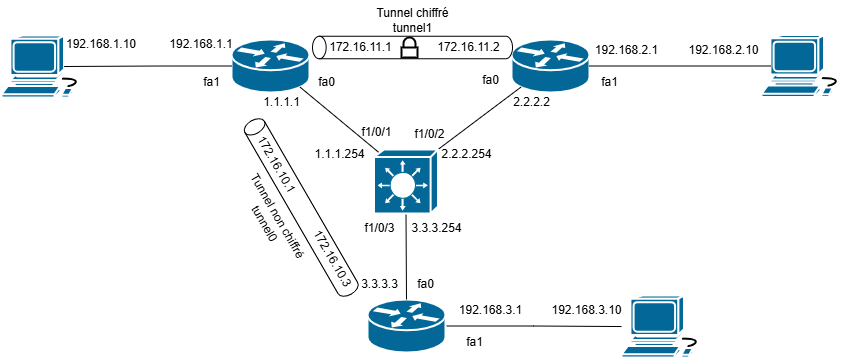

# Topologie

Le switch L3 et les 3 routeurs partagent leur table de routage avec OSPF, les interface Fa1 des routeurs n'ont pas OSPF de configuré

# Réalisation du lab
## Établissement des deux tunnels GRE
On commence par créer les tunnels GRE non sécurisé 0 et 1  (on sécurisera 1 après):
R1 :
```
int tunnel0
tunnel source fa0
tunnel destination 3.3.3.3
ip address 172.16.10.1 255.255.255.0
tunnel mode gre ip
exit
interface tunnel1
tunnel source fa0
tunnel destination 2.2.2.2
ip address 172.16.11.1 255.255.255.0
tunnel mode gre ip
``` 
R2 :
```
int tunnel1
tunnel source fa0
tunnel destination 1.1.1.1
ip address 172.16.11.2 255.255.255.0
tunnel mode gre ip
```
R3 :
```
int tunnel0
tunnel source fa0
tunnel destination 1.1.1.1
ip address 172.16.10.3
tunnel mode gre ip
```
## Chiffrement du tunnel1
R2
```
crypto isakmp policy 1
hash sha
authentication pre-share
group 2
exit
crypto isakmp key MYSECREY address 1.1.1.1
crypto ipsec transform-set MYTRANSFORMSET ah-sha-hmac esp-aes 256
mode tunnel
exit
crypto ipsec profile MYPROFILE
set transform-set MYTRANSFORMSET
exit
int tu1
no tunnel mode gre ip
tunnel mode ipsec ipv4
tunnel protection ipsec profile MYPROFILE
```
R1
```
crypto isakmp policy 1
hash sha
authentication pre-share
group 2
exit
crypto isakmp key MYSECREY address 2.2.2.2
crypto ipsec transform-set MYTRANSFORMSET ah-sha-hmac esp-aes 256
mode tunnel
exit
crypto ipsec profile MYPROFILE
set transform-set MYTRANSFORMSET
exit
int tu1
no tunnel mode gre ip
tunnel mode ipsec ipv4
tunnel protection ipsec profile MYPROFILE
```
