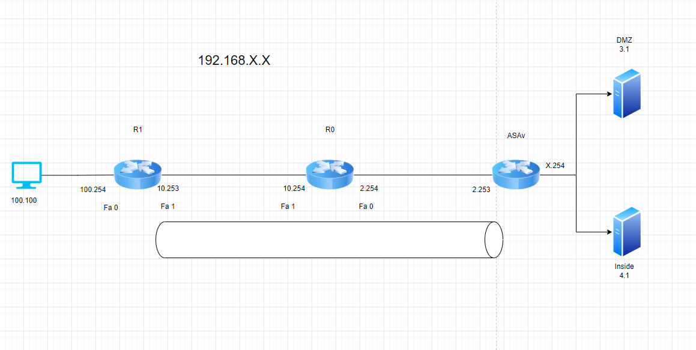
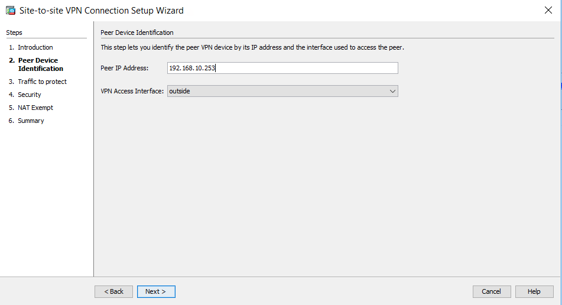
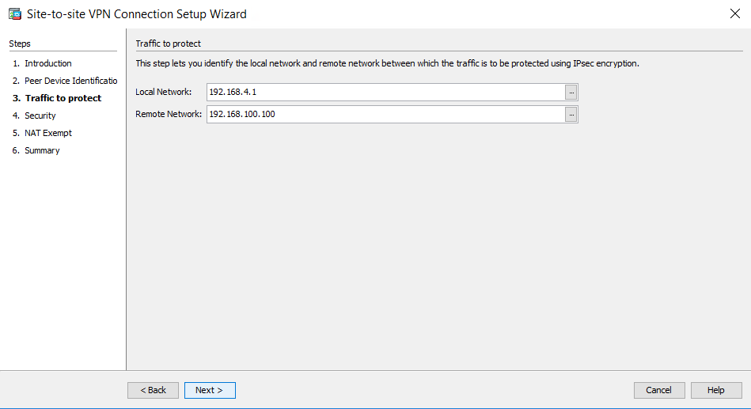
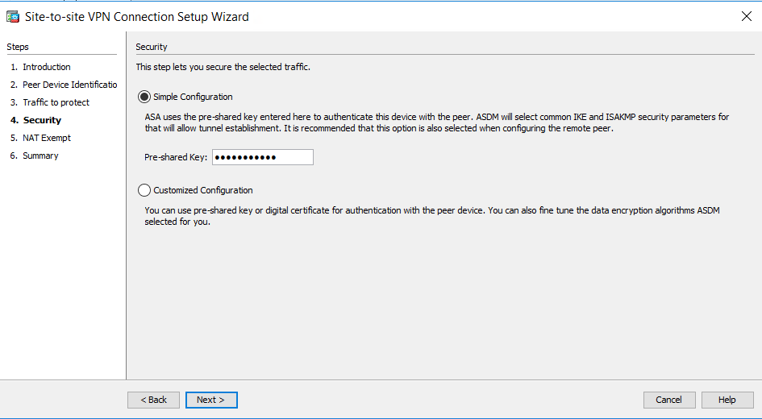
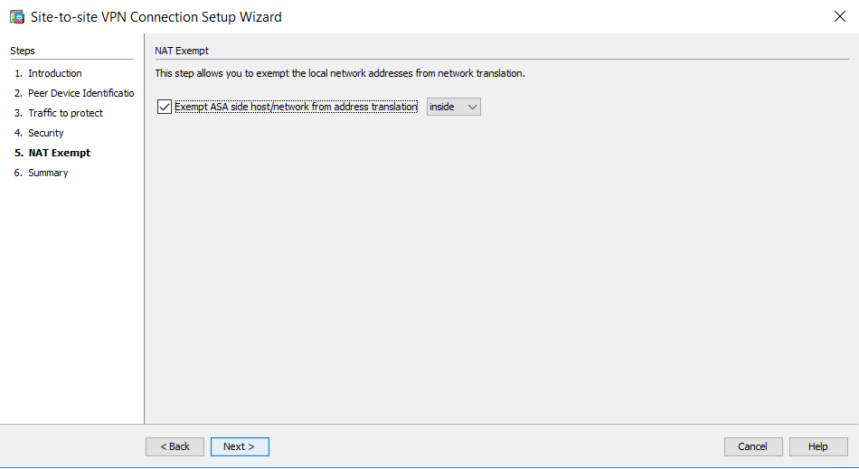

# Topologie



# Config de Base
Mise en place des IP et OSPF pour la redistribution totale des routes le tout sur chaque interface.
Les routes statique sont la car ASAv ne redistribue pas ses routes interne (4.0/24 et 3.0/24)
!!!! Possibilité de mettre OSPF sur ASAv mais pas présent dans les notes ici !!!

## R0
```
ena
conf t

hostname R0

interface FastEthernet0
 ip address 192.168.2.254 255.255.255.0
 ip ospf 10 area 0
 no shut

interface FastEthernet1
 ip address 192.168.10.254 255.255.255.0
 ip ospf 10 area 0
 no shut

router ospf 10
 router-id 2.2.2.2

ip route 192.168.3.0 255.255.255.0 192.168.2.253
ip route 192.168.4.0 255.255.255.0 192.168.2.253
end
```
## R1
```
ena
conf t

hostname R1

interface GigabitEthernet0
 no shut
 ip address 192.168.100.254 255.255.255.0
 ip ospf 10 area 0

interface FastEthernet8
 no shut
 ip address 192.168.10.253 255.255.255.0
 ip ospf 10 area 0

router ospf 10
 router-id 1.1.1.1
 
ip route 192.168.3.0 255.255.255.0 192.168.2.253
ip route 192.168.4.0 255.255.255.0 192.168.2.253
end
```

!!! ATTENTION !!!
Il faut avoir fait la configuration de base de ASAv (configuration des interfaces et Firewall sur l'ASAv) et avoir mis une route statique. Voir labo8 pour la configuration de base si nécessaire !
Firewall :

Route statique :


Normalement à ce stade tout le monde devrait pourvoir se ping sans soucis !
# Configuration ASAv
Aller dans Wizard > VPN Wizard > Site To Site VPN et suivre les configurations :
## Etape 1 (peer)

## Etape 2 (ACL)

## Etape 3 (pre-shared key)

## Etape 4 (NAT-T cocher)


Fini pour ASAv
# Configuration Ikev1 sur R1
```
hostname R1

crypto isakmp policy 10
 encr aes
 authentication pre-share
 group 2
 
crypto isakmp key MYSECRETKEY address 192.168.2.253

crypto ipsec transform-set MYTRANSFORMSET esp-aes 256 esp-sha-hmac
 mode tunnel

crypto map MYMAP 1 ipsec-isakmp
 set peer 192.168.2.253
 set transform-set MYTRANSFORMSET
 match address 100

interface FastEthernet1
 crypto map MYMAP

access-list 100 permit icmp host 192.168.100.100 host 192.168.4.1

end
```
Une fois les configurations faites lancer le tunnel via un Ping (sans le déclencheur le tunnel ne se fera pas)
Pour voir si le tunnel est bien activé et qu'il encrypte vos packets :
```
show crypto isakmp sa
show crypto ipsec sa
```

# Configuration Ikev2 sur R1
```
hostname R1

crypto ikev2 keyring IKEV2_KEYRING
 peer ASA_PEER
  address 192.168.2.253
  pre-shared-key local MYSECRETKEY
  pre-shared-key remote MYSECRETKEY

crypto ikev2 profile IKEV2_PROFILE
 match identity remote address 192.168.2.253 255.255.255.255
 authentication remote pre-share
 authentication local pre-share
 keyring local IKEV2_KEYRING

crypto ipsec transform-set MYTRANSFORMSET esp-aes 256 esp-sha-hmac
 mode tunnel

crypto map MYMAP 10 ipsec-isakmp
 set peer 192.168.2.253
 set ikev2-profile IKEV2_PROFILE
 match address 100

interface FastEthernet8
 crypto map MYMAP

access-list 100 permit ip host 192.168.100.100 host 192.168.4.1

end
```

Une fois les configurations faites lancer le tunnel via un Ping (sans le déclencheur le tunnel ne se fera pas)
Pour voir si le tunnel est bien activé et qu'il encrypte vos packets :
```
show crypto ikev2 sa
show crypto ipsec sa
```

!!! Attention à bien mettre des noms de crypto map différentes entre Ikev1 et Ikev2 aussi non vous auriez potentiellement des soucis !!!

